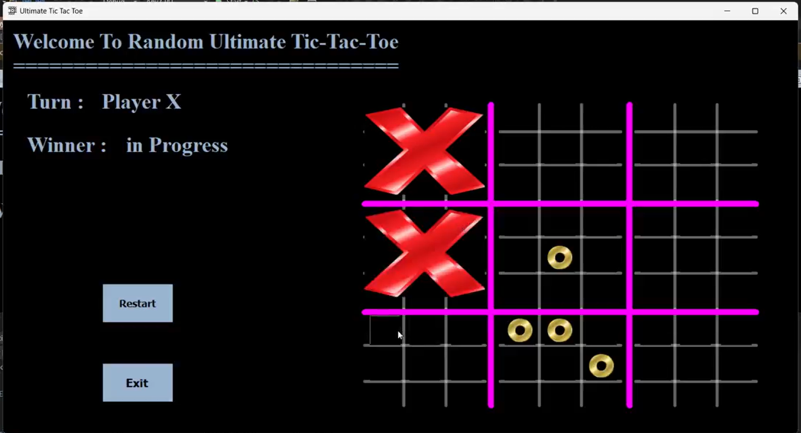
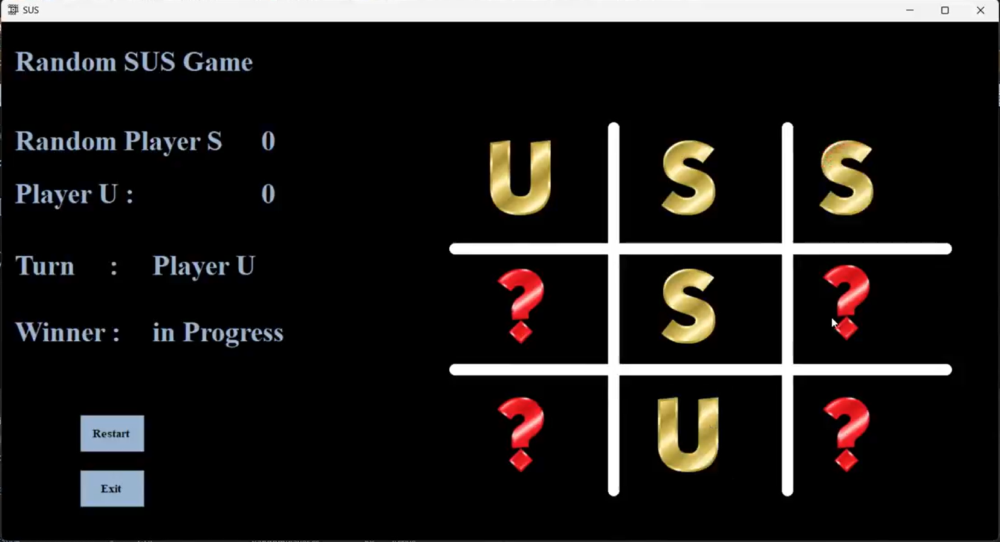

# Ultimate Tic-Tac-Toe

A Windows Forms application implementing the classic game of Ultimate Tic-Tac-Toe (also known as Super Tic-Tac-Toe or Meta Tic-Tac-Toe) in C#.





---

## 🔗 **Featured on LinkedIn**

### **[View the Project Preview on LinkedIn](https://www.linkedin.com/posts/mnbil0680_csharp-winforms-desktopapp-activity-7282287421050736641-1ALy?utm_source=social_share_send&utm_medium=member_desktop_web&rcm=ACoAAEKutdcB01n51UV7-5nMA4vxgJ9w6nFYppc)**

---

## Overview

Ultimate Tic-Tac-Toe is a larger variant of the traditional tic-tac-toe game. The board consists of nine 3×3 grids (cells), and players must win three-in-a-row on the larger 3×3 grid to win the game. This creates a more strategic and challenging gameplay experience.

## Features

- **Player vs Player Mode**: Two players can compete against each other locally
- **Player vs Random AI Mode**: Challenge a random-move AI opponent
- **Interactive GUI**: Clean and intuitive Windows Forms interface
- **Real-time Game State**: Visual feedback with X and O symbols
- **Game Reset**: Easy restart functionality

## Gameplay

### How to Play

1. **Start the Game**: Launch the application from the main menu
2. **Choose Game Mode**:
   - **Player vs Player**: Two human players take turns
   - **Player vs Random**: Play against the computer (random moves)
3. **Make Moves**: Click on any empty cell to place your mark
4. **Win Condition**: Win three consecutive small grids (horizontally, vertically, or diagonally) to win the game

### Game Rules

- Players alternate turns placing X and O marks
- Each move is made in one of the nine 3×3 grids
- The first player to win three grids in a row (on the main 3×3 board) wins the game
- Strategic thinking is required as moves affect the overall board state

## Project Structure

```
Ultimate-Tic-Tac-Toe/
├── Form1.cs                 # Two-player game interface
├── Form1.Designer.cs        # UI design file for Form1
├── RandomPlayer.cs          # Player vs AI game interface
├── RandomPlayer.Designer.cs # UI design file for RandomPlayer
├── MainMenu.cs              # Main menu screen
├── MainMenu.Designer.cs     # UI design file for MainMenu
├── Program.cs               # Application entry point
├── App.config               # Configuration file
├── problem8.csproj          # Project file
├── problem8.sln             # Solution file
├── Properties/              # Assembly and resource files
├── Resources/               # Game resources and assets
└── assets/                  # Additional game assets
```

## Game Modes

### Form1 - Player vs Player
Located in [Form1.cs](Form1.cs), this implements the two-player mode where both players are human-controlled.

**Key Features:**
- Turn-based gameplay
- Immediate win condition checking
- Automatic game state updates

### RandomPlayer - Player vs AI
Located in [RandomPlayer.cs](RandomPlayer.cs), this implements player versus computer gameplay where the AI makes random valid moves.

**Key Features:**
- AI opponent with random move selection
- Same win-condition logic as two-player mode
- Real-time move validation

## Technical Details

### Architecture

Both game modes share similar logic:

- **Win Detection**: [`checkX_threeInRow()`](Form1.cs) and [`checkO_threeInRow()`](Form1.cs) methods check for winning patterns
- **Grid Management**: Nine separate 3×3 grids managed through button controls
- **State Tracking**: Character array tracking cell states (X, O, or empty)
- **Visual Rendering**: Custom paint events for grid lines and game state

### Core Methods

- [`Handle()`](Form1.cs): Processes all game logic after each move
- [`ImageChange()`](Form1.cs): Updates UI with player marks
- [`handle_big_grid()`](Form1.cs): Checks main 3×3 grid for win conditions
- [`game_over()`](Form1.cs): Handles game completion and displays winner
- [`checkX_threeInRow()` / `checkO_threeInRow()`](Form1.cs): Win condition validation

### UI Drawing

Grid visualization is handled through PaintEventArgs with custom line drawing:
- Main grid: 10px magenta lines
- Small grids: 5px white lines
- Dynamic position calculation for each 3×3 section

## Getting Started

### Prerequisites

- .NET Framework (Windows)
- Visual Studio 2019 or later (or any C# compiler)

### Installation

1. Clone the repository:
```bash
git clone https://github.com/mnbil0680/Ultimate-Tic-Tac-Toe.git
```

2. Open the solution:
```bash
cd Ultimate-Tic-Tac-Toe
```

3. Open `problem8.sln` in Visual Studio

4. Build and run the project

## Usage

```csharp
// Starting the application
Application.Run(new MainMenu());

// Two-player game
Form1 form1 = new Form1();
form1.Show();

// Player vs AI
RandomPlayer randomPlayer = new RandomPlayer();
randomPlayer.Show();
```

## Game Screenshots

The application features a professional grid-based interface with clear visual separation between the nine game cells.

## Code Highlights

### Win Detection Example
The game uses efficient win-checking logic:

```csharp
public string checkX_threeInRow(Button b1, Button b2, Button b3, Button b4, Button b5, 
                                 Button b6, Button b7, Button b8, Button b9)
{
    // Check horizontals
    if (b1.Tag.ToString() == "X" && b2.Tag.ToString() == "X" && b3.Tag.ToString() == "X" ||
        b4.Tag.ToString() == "X" && b5.Tag.ToString() == "X" && b6.Tag.ToString() == "X" ||
        b7.Tag.ToString() == "X" && b8.Tag.ToString() == "X" && b9.Tag.ToString() == "X")
    {
        return "X";
    }
    // ... additional checks for verticals and diagonals
}
```

### Game Flow
1. Player clicks button → `button_Click()` triggered
2. `ImageChange()` updates UI with player mark
3. `Handle()` validates game state across all nine grids
4. `handle_big_grid()` checks for overall winner
5. If winner found → `game_over()` displays result

## Future Enhancements

- [ ] Difficulty levels for AI (Easy, Medium, Hard)
- [ ] Game move history and replay functionality
- [ ] Network multiplayer support
- [ ] Theme customization
- [ ] Sound effects and animations
- [ ] Elo rating system for competitive play

## Contributing

Contributions are welcome! Please feel free to submit a Pull Request.

## License

This project is open source and available under the MIT License.

## Author

**mnbil0680**

- GitHub: [@mnbil0680](https://github.com/mnbil0680)

## Acknowledgments

- Ultimate Tic-Tac-Toe concept and rules
- Windows Forms framework for UI implementation
- Community feedback and testing

---

**Last Updated**: December 2024